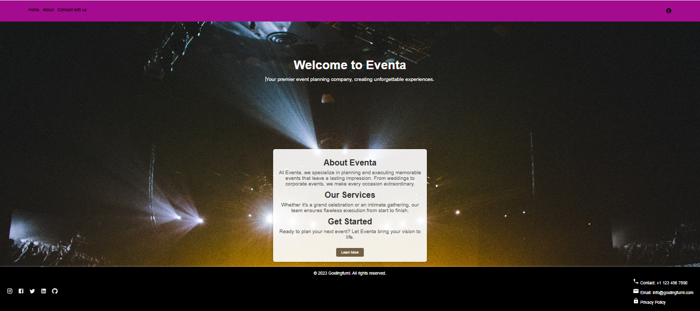

````md
# Event Organising Website

A modern and responsive **Event Organising Web Application** built using **React.js**.  
This project helps users explore, plan, and manage events with an interactive and user-friendly interface.

---

## Features

- Home page with attractive UI
- Event listing and details
- Event booking / enquiry form
- Easy navigation between pages
- Fully responsive design
- Fast and dynamic UI using React components

---

## Tech Stack

- **Frontend:** React.js
- **Styling:** CSS / Bootstrap
- **Language:** JavaScript (ES6)
- **Tools:** VS Code, npm

---

## Installation & Setup

### 1. Clone the repository

```bash
git clone https://github.com/your-username/event-organising-website.git
```

### 2. Navigate to the project folder

```bash
cd Eventa
```

### 3. Install dependencies

```bash
npm install
```

### 4. Run the project

```bash
npm start
```

### 5. Open in browser

```bash
http://localhost:3000
```

---

## Screenshots


